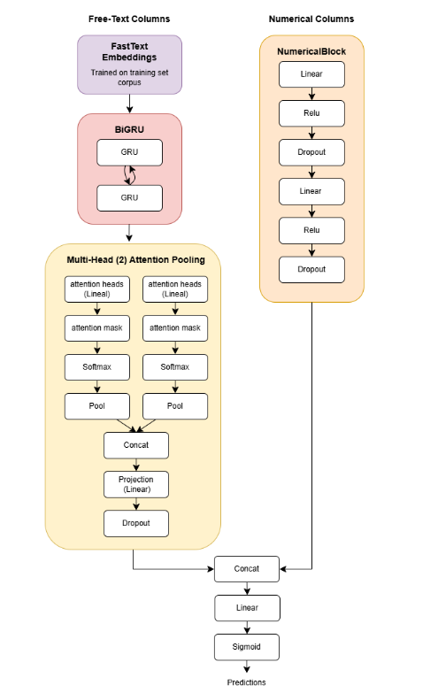
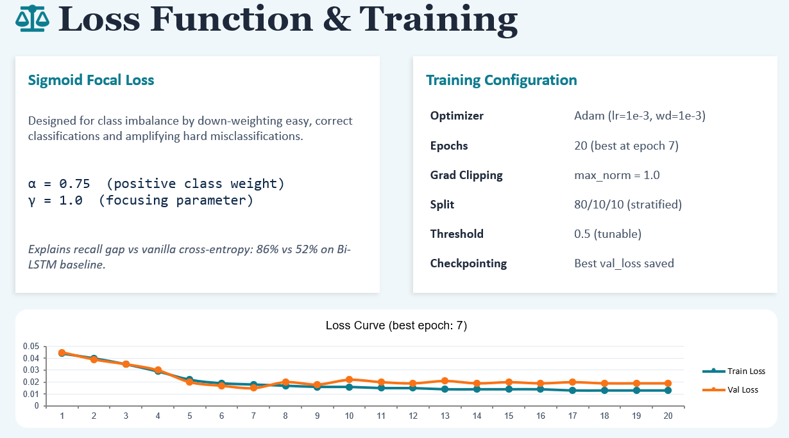
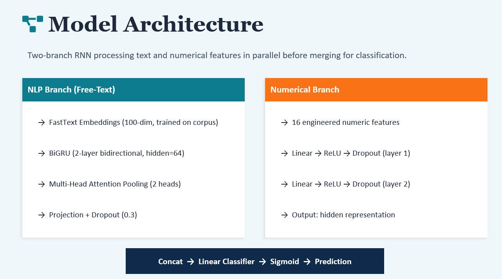
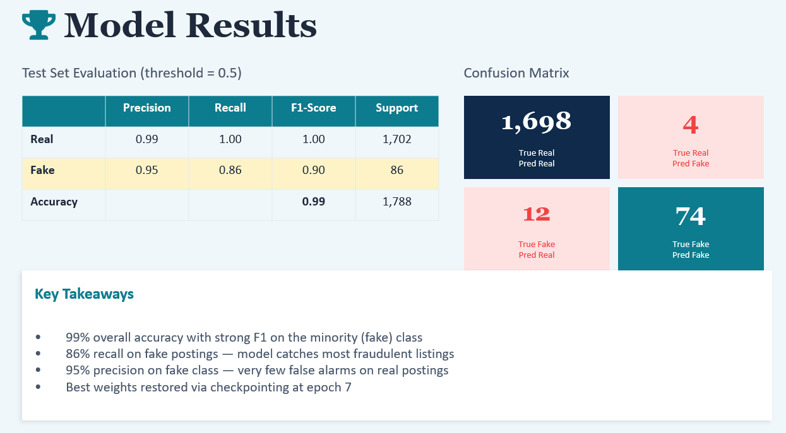

# Fake Job Posting Detection with Deep Learning

This project builds a deep learning classifier for detecting fraudulent job postings from structured job metadata and free-text job descriptions. With fraudulent postings making up only 866 of 17,880 samples, the project was designed around the problem of identifying the minority fraud class in an extremely imbalanced dataset.

The final model combines an NLP branch for job-posting text with a numerical-feature branch for structured attributes. The best recorded model used custom FastText-style embeddings, a bidirectional GRU, multi-head attention pooling, and a small feed-forward network for numerical features.

For the full methodology, experiments and discussion, see [`DL_Report_Group 23.pdf`](DL_Report_Group%2023.pdf).




## Repository Structure

```text
.
|-- data/
|   |-- raw/                         # Original dataset
|   `-- clean/                       # Cleaned/preprocessed datasets
|-- dataset_class/                   # Custom PyTorch Dataset class
|-- model_construction/              # Model architectures and reusable blocks
|-- notebooks/
|   |-- data_preprocessing.ipynb     # Cleaning, tokenization, and embedding work
|   |-- Model_training.ipynb         # Main FastText + BiGRU model training
|   |-- Model_training_distilbert.ipynb
|   `-- adversarial_attack.ipynb
|-- weights/                         # Saved model checkpoints
|-- README_assignment.md             # Original assignment-oriented notes
|-- requirements.txt
`-- DL_Report_Group 23.pdf
```

## Dataset

The project uses the Kaggle "Real or Fake: Fake Job Posting Prediction" dataset:

https://www.kaggle.com/datasets/shivamb/real-or-fake-fake-jobposting-prediction/data

The repository includes:

- `data/raw/fake_job_postings.csv`
- `data/clean/fake_job_postings_ALL.csv`
- `data/clean/embedding_tuning.csv`

The cleaned dataset is used by the main training notebook.

## Setup

The original project was developed in a notebook workflow. A Python virtual environment is recommended.

```bash
py -3.10 -m venv .venv310
.\.venv310\Scripts\Activate.ps1
python -m pip install --upgrade pip
pip install -r requirements.txt
jupyter lab
```

Note: `requirements.txt` pins a CUDA-enabled PyTorch build. If installation fails on your machine, install the PyTorch version that matches your Python, CUDA and hardware setup from the official PyTorch instructions, then install the remaining dependencies.

## Running the Project

To reproduce the main workflow from scratch:

1. Open `notebooks/data_preprocessing.ipynb`.
2. Run the preprocessing, tokenization, and embedding-related sections as needed.
3. Open `notebooks/Model_training.ipynb`.
4. Run the notebook from dataset loading through model training and evaluation.

The main training notebook expects the cleaned dataset at:

```text
data/clean/fake_job_postings_ALL.csv
```

Saved model weights are stored in:

```text
weights/
```

## Training Time

Full training can take up to several hours. The main model training is manageable on a CUDA-capable GPU, but the GRU and hidden-dimension hyperparameter tuning section is computationally expensive. In the original assignment run, that tuning section took around 5 hours.

For a quicker inspection of the project, use the existing notebooks and saved weights instead of rerunning every experiment.



## Model Summary

The primary model is implemented in `model_construction/model.py` as `FakeJobDetector`.

It uses two branches:

- Text branch: token embeddings, a 2-layer bidirectional GRU and multi-head attention pooling.
- Numerical branch: two fully connected layers with ReLU and dropout.
- Final classifier: concatenates the text and numerical representations and outputs a binary fraud logit.



Training uses sigmoid focal loss to help with class imbalance, since fraudulent postings are much rarer than real postings. The model applies a sigmoid threshold during evaluation, and the notebooks include threshold tuning to explore the precision-recall tradeoff.

Because the dataset is extremely imbalanced, overall accuracy and the F1-score for the real-posting class can look strong even when the model performs poorly on fraudulent postings. For that reason, the main evaluation focus was the `Fake` class F1-score, alongside fake-posting precision and recall.

A DistilBERT-based comparison model is also included in `model_construction/distilbert_model.py` and `notebooks/Model_training_distilbert.ipynb`. In that version, DistilBERT is frozen and used as a contextual embedding layer before the BiGRU and attention components.

## Results

The best recorded final model was saved as:

```text
checkpoint = weights/best_model.pt
```

Recorded test-set performance at threshold `0.5`:

| Class | Precision | Recall | F1-score | Support |
| --- | ---: | ---: | ---: | ---: |
| Real | 0.99 | 1.00 | 1.00 | 1702 |
| **Fake** | **0.95** | **0.86** | **0.90** | **86** |

Overall accuracy was approximately `0.99` on `1788` test samples, with macro average F1-score of `0.95` and weighted average F1-score of `0.99`.

The most important result is the `Fake` class F1-score of `0.90`, since fake postings are the minority class and are the target the model is meant to catch. The branch evaluation showed that the NLP branch carried most of the predictive signal, while the numerical branch added secondary structured information.



## Report

The full technical write-up is available here:

[`DL_Report_Group 23.pdf`](DL_Report_Group%2023.pdf)

It contains the detailed background, preprocessing decisions, model design, experiment setup, and discussion of results.
